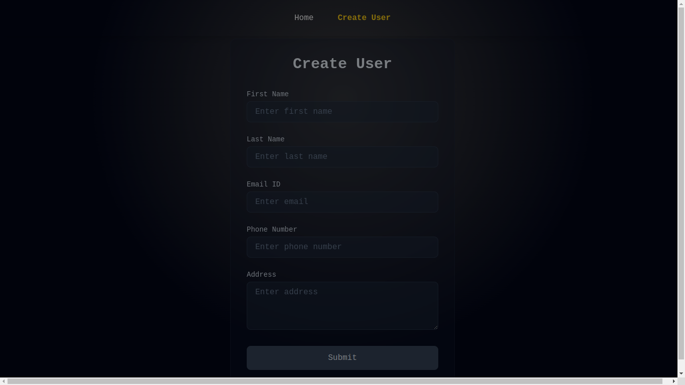

# Basic Crud 

Hey guys This is a very simple crud application and i am still in learning process, i have used react-hot-toast, redux-toolkit + react-redux + routing

Can Anyone Please Fix these problems ? please
---------------------------------------------
In This UI as you can see the Data is not being showing properly 

In this UI, as you can see at the bottom the UI is exceeding 

----------------------------------------------
And also As you can see the Form looks good with some translucency effects and i want that affect on the data table shown 

Btw, I only wrote the logic stuffs like routing , redux, slice, adding to localstorage,,

i used claude for the frontend as claude makes good frontend than chatgpt